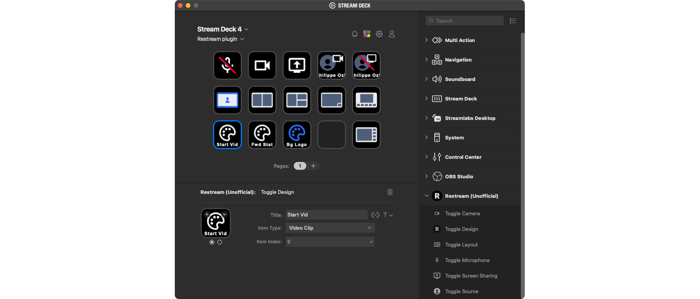

# Unofficial Streamdeck Plugin for Restream

## Overview

Unofficial Elgato Streamdeck plugin that controls Restream Studio via a Chrome Extension.

This solution requires three components to run:
1. A Node.js server
1. A Chrome extension
1. A Streamdeck plugin (this project)

## Streamdeck Plugin Setup

Download the [latest plugin version](/releases/latest/download/org.pozil.restream.streamDeckPlugin).

Install the plugin.

You're done with the Streamdeck plugin setup.
At this point you should have installed the Chrome extension and the server should be up and running.

## Troubleshooting

**Streamdeck button shows a ⚠️ warning symbol**

This either means that the server is not running or that the server cannot reach the Chrome extension.
